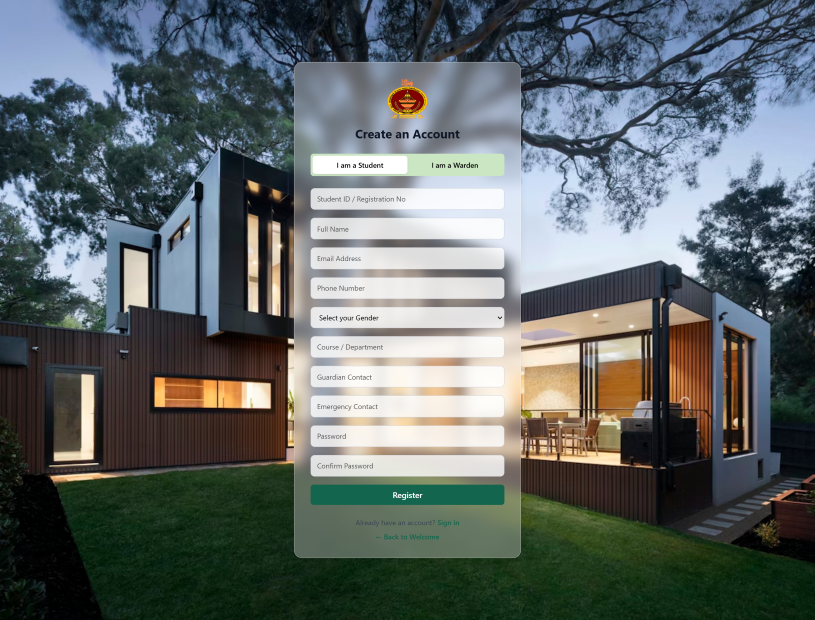
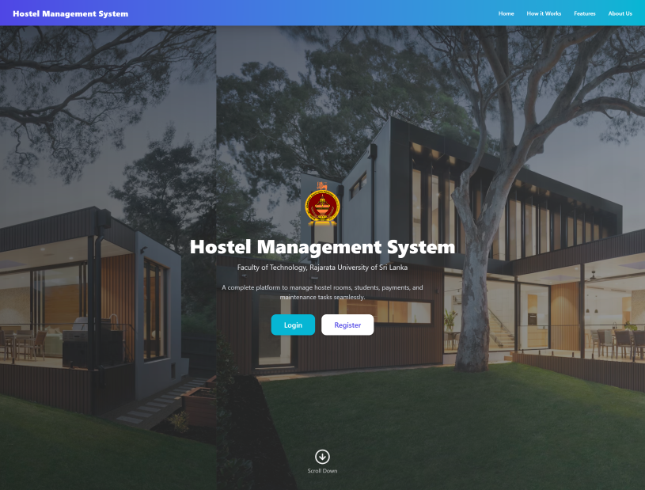
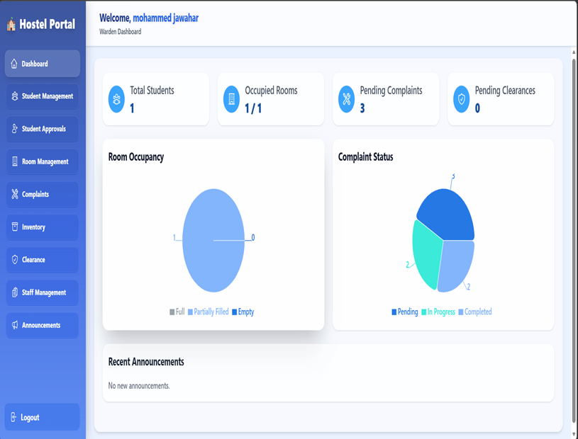
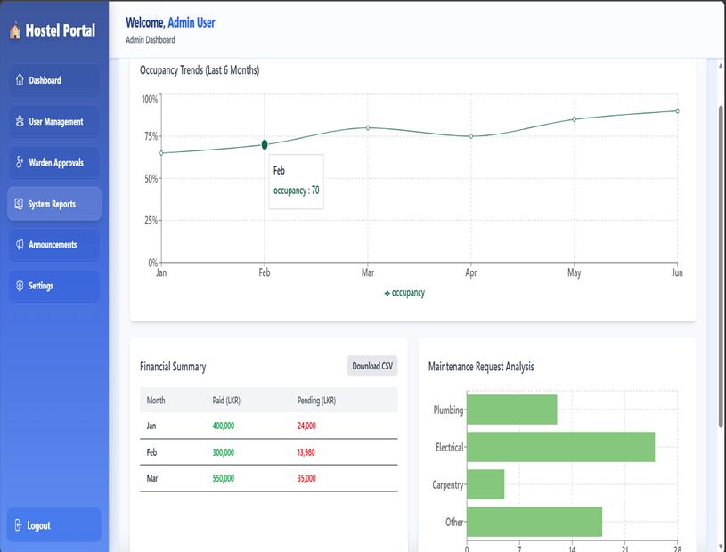
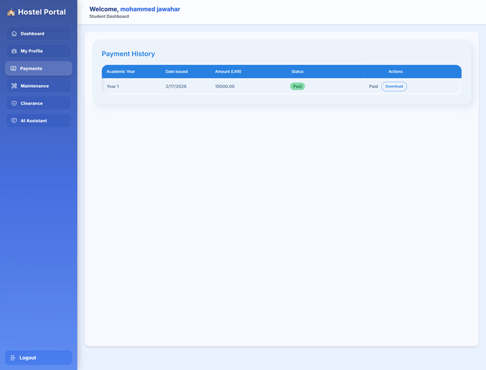

# Hostel Management System – Faculty of Technology


The Hostel Management System is a web-based application developed for the Faculty of Technology to streamline hostel operations. It provides an efficient platform for managing student accommodation, room allocation, and administrative tasks.
This project was developed as a 3rd-year ICT project at Rajarata University.

## 📱 Screenshots

<p align="center">
  
  
  
  
   
</p>

<p align="center">
  <em>Student Register • Landing Page • Warden Dashboard • Admin Report • Student Payment</em>
</p>


## ✨ Features

- 🧑‍🎓 **Student Registration & Authentication** - Secure login and account management  
- 🏢 **Hostel & Room Allocation** - Efficiently assign and manage rooms  
- 🛠️ **Admin Dashboard** - Manage students, rooms, and hostel data  
- 📊 **Real-time Room Availability** - Track available and occupied rooms instantly  
- 📩 **Application Requests & Approvals** - Handle hostel requests   
- 🔐 **Secure Authentication** - Role-based access control
- 📱 **Responsive Design** - Works on mobile, tablet, and desktop
- 🌙 **Dark/Light Theme** - Customizable UI experience

## 🚀 Technologies Used
- **Frontend**
   React-
   TypeScript-
   Tailwind CSS
- **Backend**
   Node.js-
   Express.js-
   Database-
   MongoDB Atlas
- **Database**
   MongoDB Atlas

### Installation

Prerequisites
Node.js
npm or yarn
MongoDB Atlas account

1. **Clone the repository**
   ```bash
   git clone https://github.com/your-username/hostel-management-system.git
2. **Navigate to the project directory**
   ```bash
   cd hostel-management-system
3. **Install dependencies Frontend Backend**
   ```bash
   cd client
   npm install
   cd server
   npm install
4. **Set up environment variables**
   ```bash
   MONGO_URI=your_mongodb_connection_string
   PORT=5000
5. **Set up environment variables**
   ```bash
   npm start

✨License

This project is developed for academic purposes and is not licensed for commercial use.
   
